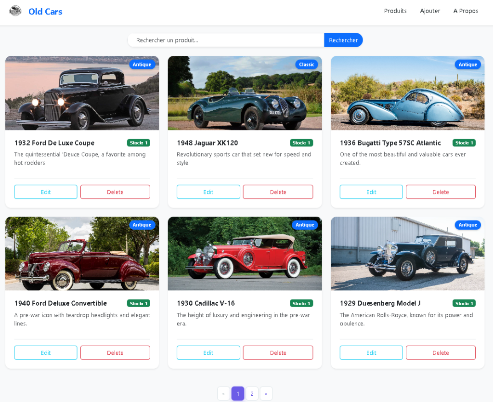
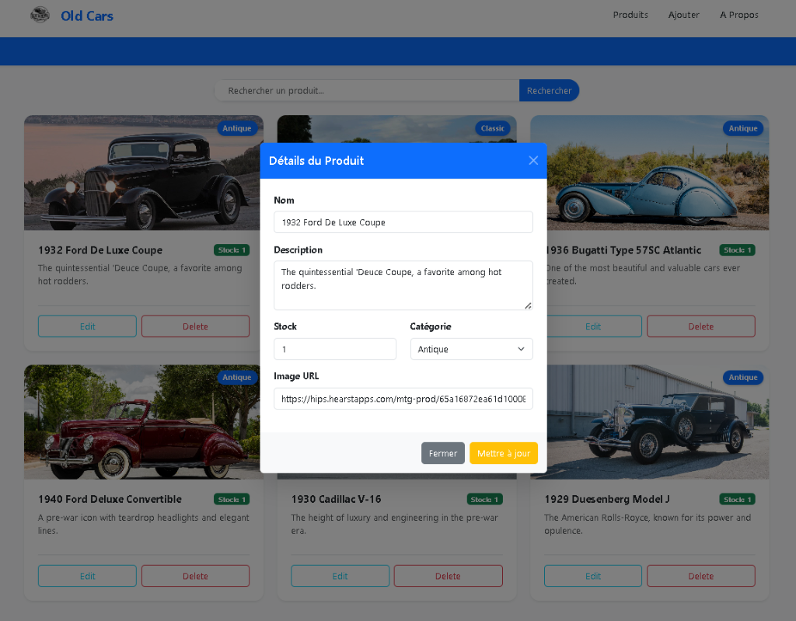
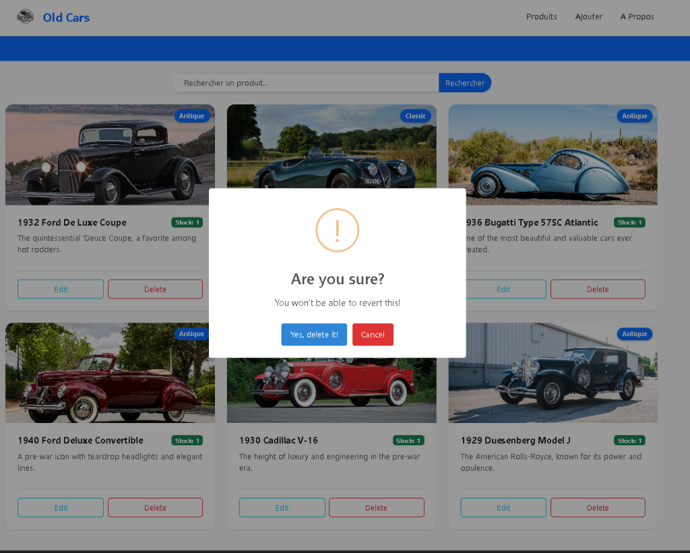
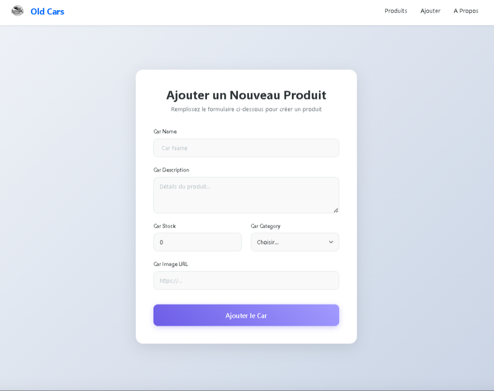
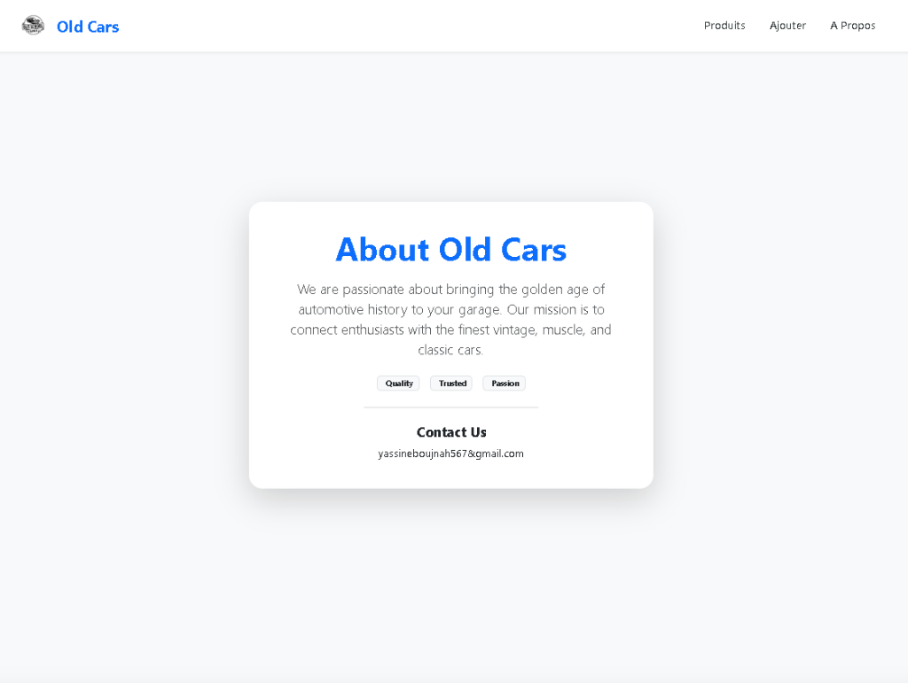

# Old Car Angular Project 🚗

A modern Angular application for managing a collection of classic and antique cars. This project features a sleek UI with car listings, search functionality, detailed product modals, and a form to add new cars.

## 📸 Screenshots

### Home Page (List View)


### Product Edit


### Delete Confirmation


### Adding a New Car


### About Page


## 🚀 Getting Started

Follow these instructions to get the project up and running on your local machine.

### Prerequisites

- [Node.js](https://nodejs.org/) (v18 or higher recommended)
- [Angular CLI](https://angular.io/cli) (`npm install -g @angular/cli`)

### Installation

1. **Clone the repository**:
   ```bash
   git clone https://github.com/yassinebj50/Old_Car_Angular.git
   cd Old_Car_Angular
   ```

2. **Install dependencies**:
   ```bash
   npm install
   ```

## 🛠️ Running the Project

This project requires both the Angular development server and a JSON server for the mock backend.

### 1. Start the JSON Server (API)
The backend uses `json-server` to serve data from `db.json`.
```bash
npx json-server --watch db.json
```
The API will be available at `http://localhost:3000`.

### 2. Start the Angular Application
Run the development server:
```bash
ng serve
```
Navigate to `http://localhost:4200/`. The app will automatically reload if you change any of the source files.

## 📊 API & Data Structure

The project uses a simple JSON database (`db.json`) with the following structure for products:

```json
{
  "products": [
    {
      "id": "0",
      "name": "1932 Ford De Luxe Coupe",
      "description": "...",
      "stock": 1,
      "category": "Antique",
      "images": ["url..."]
    }
  ]
}
```

## 🧰 Built With

- **Angular 17** - Web framework
- **Bootstrap 5** - Styling and layout
- **SweetAlert2** - Beautiful alerts
- **JSON Server** - Mock REST API

